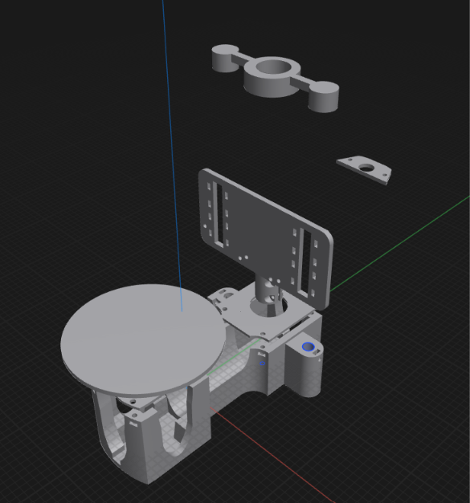

# 3D-Printed Frame

This folder contains the **3D-printable mechanical frame and structural components** developed for the **ESP32-S3-Based 3D Scanning System**.

The mechanical frame is designed to provide a stable structure for the 3D scanner and support the installation of the main hardware components, such as the **ESP32-S3 development board, stepper motor, motor driver, scanning components, and other mechanical parts**.

The design process focuses on creating a compact, stable, and practical structure that can be easily manufactured using **3D printing technology**. The mechanical models were designed using **Shapr3D**, a CAD (**Computer-Aided Design**) tool used for creating and modifying 3D mechanical models.

## Contents

* **3D Models** – STL files prepared for 3D printing.
* **CAD Files** – Original mechanical design files created using Shapr3D.
* **Reference Images** – Images of the mechanical design and different views of the 3D scanner.

The mechanical frame is an important part of the system because it ensures proper component positioning and provides a stable platform for the 3D scanning process.
